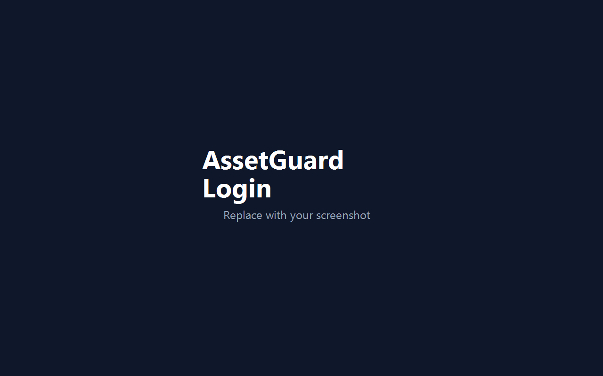
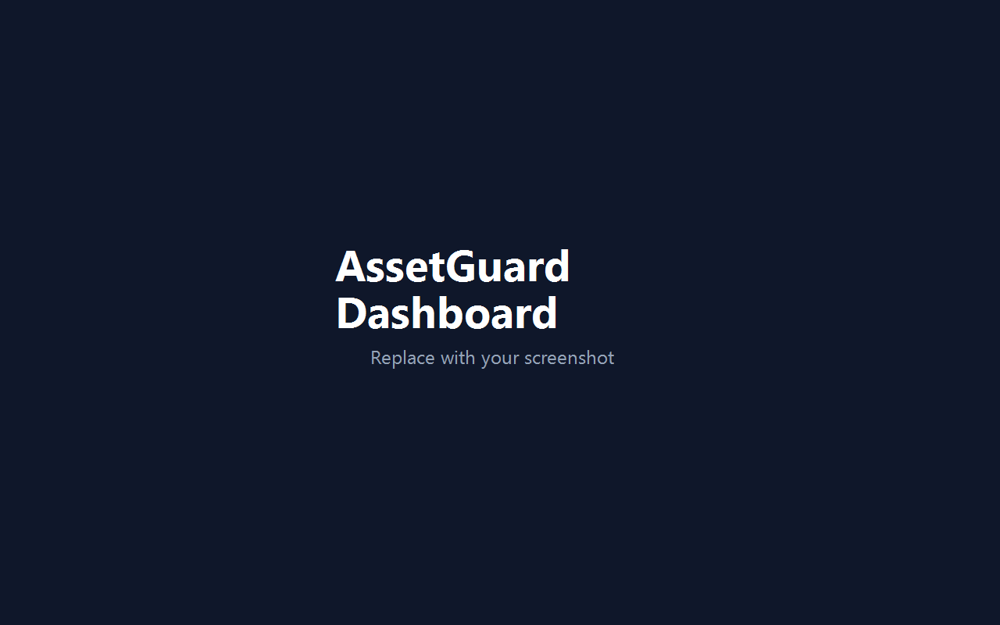
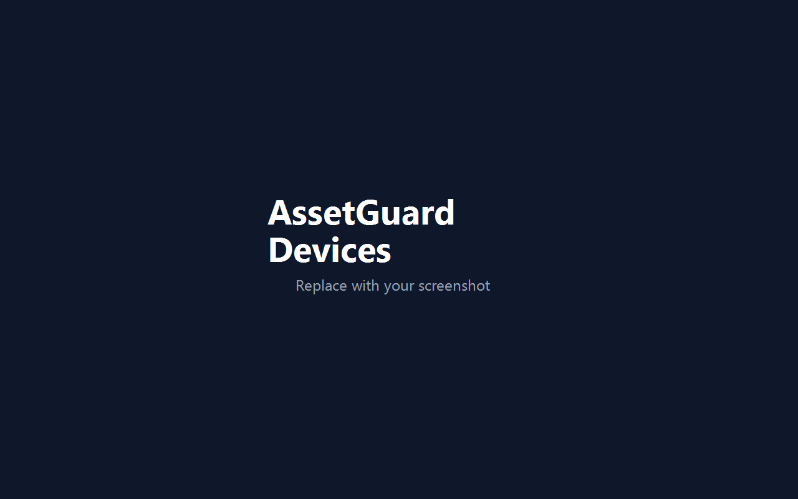
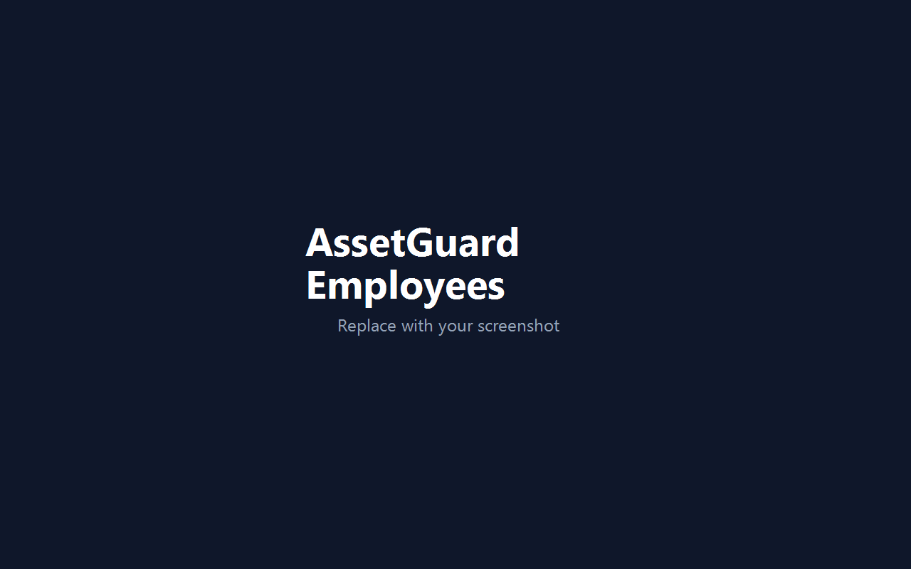
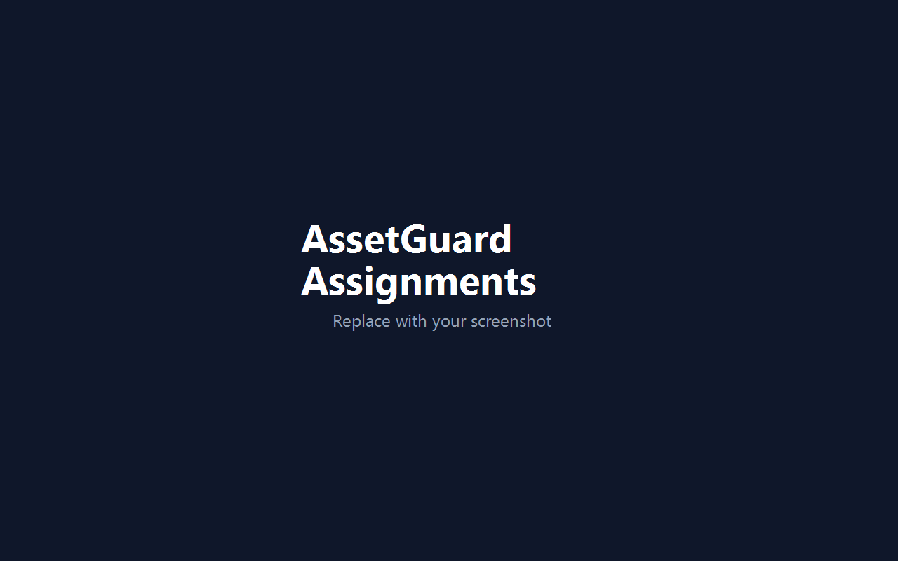
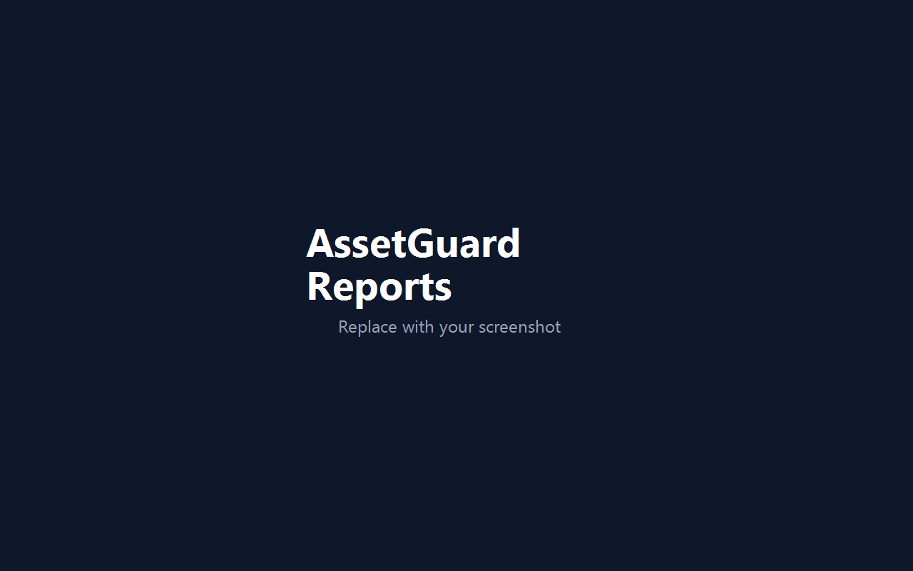
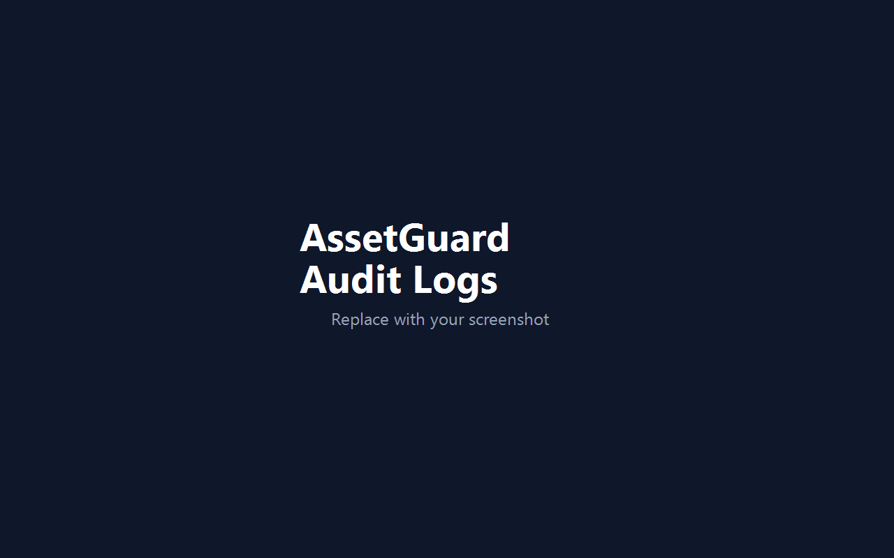

# AssetGuard

> Enterprise IT Asset Management System built with ASP.NET Core MVC, MSSQL, Dapper, Bootstrap, and Chart.js.


AssetGuard is an enterprise-style IT asset management platform for tracking corporate devices across their full lifecycle — inventory, employee assignments, maintenance, warranties, operational reporting, audit compliance, and admin user management.

---

## Tech Stack

| Layer | Technology |
|-------|------------|
| Framework | ASP.NET Core 9 MVC |
| Data Access | Dapper + Microsoft.Data.SqlClient |
| Database | SQL Server / LocalDB |
| Authentication | Custom cookie auth, BCrypt password hashing |
| Export | ClosedXML (Excel), QuestPDF (PDF) |
| QR Codes | QRCoder |
| Charts | Chart.js 4 |
| UI | Bootstrap 5, Bootstrap Icons |

---

## Features

| Module | Description |
|--------|-------------|
| **Dashboard** | KPI cards and six analytics charts (status, type, department, maintenance costs, assignment trends, warranty forecast) |
| **Devices** | CRUD, filters, detail page with QR code, activity timeline, and audit feed |
| **Employees** | CRUD, soft deactivate, assignment history, activity timeline |
| **Assignments** | Assign and return workflow with full history |
| **Maintenance** | Cost tracking, upcoming alerts, device status integration |
| **Warranties** | Active, expiring, and expired warranty tracking |
| **Reports** | Five filterable reports with Excel and PDF export |
| **Audit Logs** | Full activity trail with filters and export |
| **User Management** | Admin-only: create users, deactivate users, roles (Admin, ITStaff, Viewer) |
| **UI** | Enterprise layout, dark mode toggle, responsive design |

---

## Architecture

```
AssetGuard.Web           → Controllers, Views, ViewModels, export services
AssetGuard.Application   → Business services (Device, User, Dashboard, Timeline…)
AssetGuard.Infrastructure → Dapper repositories, SqlConnectionFactory
AssetGuard.Core          → Models, interfaces, DTOs, enums
                               ↓
                          SQL Server / LocalDB
```

**Patterns:** Layered architecture, repository pattern, service orchestration, audit logging on mutations, role-based authorization for admin features.

---

## Screenshots

### Login

Secure sign-in page with demo credential notice for local portfolio review.



### Dashboard

Operations dashboard with KPI cards and analytics charts for asset health and trends.



### Devices

Device inventory list with filters, status badges, and links to detail pages.



### Employees

Employee directory with department info, active status, and assignment history access.



### Assignments

Assignment workflow for assigning devices to employees and recording returns.



### Maintenance

Maintenance records with cost tracking and upcoming service alerts.


### Warranties

Warranty tracker showing active, expiring, and expired coverage by device.


### Reports

Reports hub with five operational reports and Excel/PDF export options.



### Audit Logs

Audit log viewer with filters for user, entity, and action type.



> Replace placeholder images in `docs/screenshots/` with your own captures before publishing. See [docs/screenshots/README.md](docs/screenshots/README.md) for the recommended list.

---

## Local Setup

### Prerequisites

- [.NET 9 SDK](https://dotnet.microsoft.com/download)
- SQL Server LocalDB (included with Visual Studio) or SQL Server Express
- `sqlcmd` (SQL Server command-line tools)

### 1. Clone the repository

```powershell
git clone https://github.com/tolga-ileri/AssetGuard.git
cd AssetGuard
dotnet restore
```

### 2. Configure development settings

Copy the example configuration file (this file is gitignored):

```powershell
copy src\AssetGuard.Web\appsettings.Development.example.json src\AssetGuard.Web\appsettings.Development.json
```

### 3. Start LocalDB

```powershell
sqllocaldb start MSSQLLocalDB
sqllocaldb info MSSQLLocalDB
```

### 4. Create the database

**Option A — setup script (recommended):**

```powershell
sqlcmd -S "(localdb)\MSSQLLocalDB" -I -i Database\Scripts\DatabaseSetup.sql
```

**Option B — automated PowerShell script:**

```powershell
.\Database\Setup-LocalDb.ps1
```

**Option C — full script directly:**

```powershell
sqlcmd -S "(localdb)\MSSQLLocalDB" -I -i Database\Scripts\AssetGuard_Complete.sql
```

### 5. Run the application

```powershell
dotnet run --project src/AssetGuard.Web
```

Open **http://localhost:5156**

---

## Demo Credentials

| Username | Password | Role |
|----------|----------|------|
| `admin` | `Admin@123` | Admin |

> **Security warning:** The database seed script creates a default admin account with a known password (`Admin@123`) for **local demo and portfolio review only**. This is intentional demo seed data — **never use these credentials in production**. Create new admin users via User Management and remove or change the seed account before deploying.

There is **no public self-registration**. Additional users are created by an Admin through **Users → Create User**.

| Role | Access |
|------|--------|
| **Admin** | Full access including User Management |
| **ITStaff** | Standard operational modules |
| **Viewer** | Read-oriented access (portfolio demo) |

---

## Database Setup

| Script | Purpose |
|--------|---------|
| `Database/Scripts/DatabaseSetup.sql` | Entry point — runs full setup via `:r` include |
| `Database/Scripts/AssetGuard_Complete.sql` | Full schema + seed data |
| `Database/Scripts/001_CreateDatabase.sql` | Create database only |
| `Database/Scripts/002_CreateTables.sql` | Tables and indexes |
| `Database/Scripts/003_SeedData.sql` | Demo seed data |
| `Database/Setup-LocalDb.ps1` | Automated LocalDB setup |

Production connection string template in `appsettings.json`:

```json
"DefaultConnection": "Server=YOUR_SERVER;Database=AssetGuardDb;User Id=YOUR_USER;Password=YOUR_PASSWORD;TrustServerCertificate=True;MultipleActiveResultSets=True;"
```

Replace all placeholders — **never commit real passwords**.

---

## Security Notes

- Passwords stored as BCrypt hashes; plain text never persisted
- `appsettings.Development.json` excluded from git via `.gitignore`
- `appsettings.json` ships with placeholder credentials only
- Cookie authentication with 8-hour sliding expiration
- All pages require authentication except login
- User Management restricted to **Admin** role
- Audit logging on create, update, delete, assign, return, login, logout, and deactivate
- No self-registration endpoint exposed

---

## Future Improvements

- Role-based page-level permissions (ITStaff vs Viewer granularity)
- Email notifications for warranty expiry and maintenance due dates
- Azure AD / OpenID Connect integration
- Docker Compose deployment profile
- Automated integration tests
- REST API layer for mobile asset scanning

---

## Project Structure

```
AssetGuard.sln
Database/Scripts/            SQL schema and seed scripts
docs/screenshots/            Portfolio screenshots
src/
  AssetGuard.Core/           Models, DTOs, interfaces, enums
  AssetGuard.Application/    Business services
  AssetGuard.Infrastructure/ Dapper repositories
  AssetGuard.Web/            MVC application
LICENSE                      MIT License
```

---

## License

This project is licensed under the [MIT License](LICENSE).

---

## Author

Portfolio project demonstrating enterprise ASP.NET Core development with clean architecture, Dapper, and operational IT asset management workflows.
